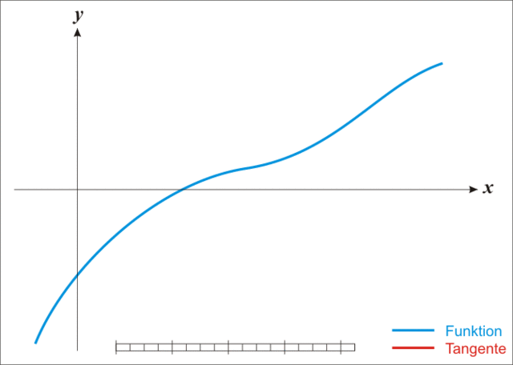

# LIN's Machine Learning Note

### Logistic Regression

We are going to enter the domain of classification problem. Suppose you have a bunch of data about a series of instances and want an algorithm to estimate whether another instance has or does not have a certain quality. Normally, we want the algorithm to output 1 to indicate positive and 0 to indicate negative.  

But a function that only outputs 0 and 1 is unfriendly for mathematical reasons, we need a continuous function that outputs a value ranging from 0 to 1. And if the value is bigger than 0.5, we absolutely wound believe that the instance is relatively more likely to have that certain quality while an output which is smaller than 0.5 wound indicate that the instance may not have that quality. In this way, we may consider the output as the probability of the instance to have that quality based on all the given attributes this instance has. 

One of this kind of function is defined as  $g(z)=\frac{1}{1+e^{-z}}$  which have a shape like this: 

 

Since we need a hypothesis function, we need to associate $g(z)$ with all the attributes of an instance, we can simply substitute $z$ with $\vec{W}\cdot \vec{X}$. So we have our hypothesis function: 

$$ H(\vec{W},\vec{X})=\frac{1}{1+e^{-\vec{W}\cdot \vec{X}}} $$

Now what should be our loss function? Well, we have to first how to evaluate how well $H(\vec{x})$ predicts for one instance in our data, since the output of our hypothesis function is the probability for that instance to have a certain quality and if that instance do have that quality then, of course the closer $H$ is to 1, the better our $H$ is. But if that instance does not have that quality, the closer $H$ is to 0, the better $H$ is.

So we may write our loss function for one instance as: 

$$\begin{cases}-(1-H(\vec{x_i}))& ,y_i=1\\-(H(\vec{x})-0)& ,y_i=0  \end{cases} $$

We can rewrite this as $-(1-H(\vec{x_i}))^{y_i}\cdot (H(\vec{x_i}))^{1-y_i}$, you can easily tell that they are the same.  And since  we are going to sum up all the individual loss, products will make things complex. Notice that $ln(x)$ function increases whenever $x$ increases and it can also make products in $x$ become simple additions. So it makes perfect sense for us to take the $e$ based logarithm of our individual loss: 

$$ -y_i ln(1-H(\vec{x_i}))-(1-y_i)ln(H(\vec{x_i})) $$

And sum up all the individual loss to get the overall loss: 

 $$ L=\sum_{i=1}^{n} -y_i ln(1-H(\vec{x_i}))-(1-y_i)ln(H(\vec{x_i}))$$

So finally, what we are going to do is just try to minimize our loss function. 

You can simply use normal gradient descent to estimate all the parameters. 

$$ (k_0^{\prime},k_1^{\prime},\cdots,k_n^{\prime})=(k_0,k_1,\cdots,k_n)+\alpha(-\vec{\nabla}\cdot H) $$

- Derivation for Logistic Regression in Statistical Manner  

  To derive logistic regression in a statistical manner, we have to first make a few assumptions: 

  1. In the consideration of that the value of random variables $y_i$ is just $0$ or $1$, we would reasonably assume that the random variables $y_i$ are distributed as **Bernoulli** distribution: 

     $y_i \sim B(p)$  

     where $p$ is the probability of $y_i=1$ 

  2. We assume that our hypothesis function to be the probability of $y_i=1$ given $W$ and $\vec{X}_i$, so the distribution of $y_i$ would be: 

     $$y_i\sim B(H(W,\vec{X}_i))$$  
     
  3. All the random variables $y_i$ are IID. 

  the distribution mass function of $y_i$ would be: 

  $$f(y_i|H(\vec{X}_i))=(H(\vec{X}_i))^{y_i}(1-H(\vec{X}_i))^{1-y_i}$$

  Now we can use **Maximum Likelihood Estimate**. 

  $$\begin{align}L(W)&=\prod_{i=1}^{m}f(y_i|H(\vec{X}_i))\\&=\prod_{i=1}^{m}(H(\vec{X}_i))^{y_i}(1-H(\vec{X}_i))^{1-y_i}\end{align}$$

  Again, the log likelihood: 

  $$\begin{align}LL(W)=log[L(W)]&=\sum_{i=1}^{m}log[(H(\vec{X}_i))^{y_i}(1-H(\vec{X}_i))^{1-y_i}]\\&=\sum_{i=1}^{m}y_i log[H(\vec{X}_i)]+(1-y_i)log[1-H(\vec{X}_i)]\end{align}$$   

  Finally, we just need to maximize the log likelihood to estimate parameters $W$ in which case you can use gradient ascent or Newton's method.  

- Newton's Method  

  What is the Newton's method? Well, it is originally a method to estimate the zero points of a function. It has been widely used in finding the minimum or maximum of a function by finding the zero point of the first derivative of that function.  

  Generally, given an $n$-ary function $f(\vec{x}):\R^n\rightarrow \R$ which, we assume, is twice differentiable, we now seek to solve the optimization problem: 

  $$min\, f(\vec{x})$$  

  Say we are now at $\vec{x_k}$, then the **second-order Taylor expansion** of $f(\vec{x})$ in the **vicinity** of $\vec{x}_k$ would be: 

  $$f(\vec{x}_k)+\frac{1}{1!}[\nabla_{\vec{x}} f(\vec{x}_k)]^T(\vec{x}-\vec{x}_k)+\frac{1}{2!}(\vec{x}-\vec{x}_k)^T H_{f}(\vec{x}_k)(\vec{x}-\vec{x}_k)\approx f(\vec{x})\tag{1}$$

  where $H_f{\vec{x_k}}$ is the Hessian matrix of $f$ at $\vec{x_k}$. 

  We know that the closer $\vec{x}$ is to $\vec{x_k}$, the more accurate this approximation would be.  

  Let's first rewrite our approximation function with now $g(\vec{x_k})$ denoting $\nabla_{\vec{x}} f(\vec{x}_k)$ :

  $$f_{Approxi}(\vec{x})=f(\vec{x}_k)+g(\vec{x}_k)^T(\vec{x}-\vec{x}_k)+\frac12 (\vec{x}-\vec{x}_k)^T H_{f}(\vec{x}_k)(\vec{x}-\vec{x}_k)\tag{2}$$

  Since $f_{Approxi}$ is an approximation of $f$, it is reasonable to think that the minimum point of $f_{Approxi}$ could be in some way close to the minimum point of $f$. But, remember, $f_{Approxi}$ is just the approximation of $f$ at **the vicinity** of $\vec{x_K}$, so if the minimum point of $f$ is very close to $\vec{x_k}$, then of course its approximation at $\vec{x_k}$ would also have a minimum point which is very close to the minimum point of $f$. But what if $\vec{x_k}$ is not that close to the minimum point of $f$?

  Well, say your function $f$ has an minimum point $\vec{P}$,  it has been proven that if you jump to the minimum point of a approximation function $f_{Approxi}$ of $f$ at a certain point which is **within a certain neighboring range of** $\vec{P}$, you are actually approaching  $\vec{P}$, the real minimum point of $f$.  

  So, if you do this iteratively, you would end up getting very very close to the minimum point of $f$ :  

  

  This is then, Newton's method.

  So, going back to our equation $(2)$, as the first iteration, we have to get the minimum point $\vec{x}_{k+1}$ of our approximation function $(2)$. As usual, we first take the gradient of $f_{Approxi}$ and then set it equal to zero : 

  $$\begin{align}&(\nabla_{\vec{x}}f_{Approxi})|_{\vec{x}=\vec{x}_{k+1}}=g(\vec{x_k})^T+H_f(\vec{x_k})(\vec{x}_{k+1}-\vec{x_k})=\vec{0}\\\Rightarrow\,&(\vec{x}_{k+1}-\vec{x_k})=-[H_f(\vec{x_k})]^{-1}g(\vec{x_k})\\\Rightarrow\,&\vec{x}_{k+1}=\vec{x_k}-[H_f(\vec{x_k})]^{-1}g(\vec{x_k}) \tag{3} \end{align}$$ 

  With $d(\vec{x_k})$ denoting $-[H_f(\vec{x_k})]^{-1}g(\vec{x_k})$, we can rewrite equation $(3)$ as: 

  $$\vec{x}_{k+1}=\vec{x_k}+d(\vec{x_k}) \tag{4}$$　

  This is then, our iterative equation. As the iterative process goes on, the $g(\vec{x}_k)$ term is approaching $0$, so you can stop the process when $g(\vec{x}_k)$ is small enough.  

  In practice, this method could have many problems, fist, the start point has to be close enough to the minimum point otherwise it might not work, second, if the size of  the Hessian matrix $H_f$ is huge, computing its reverse would be extremely time-consuming. 

  Damping Newton's method is put forward to solve the first problem and some quasi Newton's method including   SR1, DFP, BFGS are invented to address the second.   

  The basic idea behind quasi newton's methods is to find a matrix(or the inverse of a matrix) that has an important properties that $H_f$ has, so that this matrix could substitute $H_{f}$ (or $H_f^{-1}$) and make it easier to iterate without having to inverse a matrix. The crucial property that $H_f$ has is called quasi Newton's method condition.   

  More at: 

  <https://blog.csdn.net/u012294618/article/details/79750224>

  <https://blog.csdn.net/songbinxu/article/details/79677948>

  <https://zhuanlan.zhihu.com/p/30779948>

  <https://zhuanlan.zhihu.com/p/37524275>

  <https://zhuanlan.zhihu.com/p/81623816>

- Some articles that might be helpful or dive more deeply :

  [Stanford CS109 L25 Note[PDF]](http://web.stanford.edu/class/cs109/lectureNotes/LN25_logistic_regression.pdf)

  [Interpretable ML Book - LR](https://christophm.github.io/interpretable-ml-book/logistic.html)