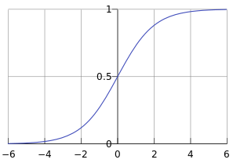

# LIN's Machine Learning Note

### Logistic Regression

We are going to enter the domain of classification problem. Suppose you have a bunch of data about a series of instances and want an algorithm to estimate whether another instance has or does not have a certain quality. Normally, we want the algorithm to output 1 to indicate positive and 0 to indicate negative.  

But a function that only outputs 0 and 1 is unfriendly for mathematical reasons, we need a continuous function that outputs a value ranging from 0 to 1. And if the value is bigger than 0.5, we absolutely wound believe that the instance is relatively more likely to have that certain quality while an output which is smaller than 0.5 wound indicate that the instance may not have that quality. In this way, we may consider the output as the probability of the instance to have that quality based on all the given attributes this instance has. 

One of this kind of function is defined as  $g(z)=\frac{1}{1+e^{-z}}$  which have a shape like this: 

 

Since we need a hypothesis function, we need to associate $g(z)$ with all the attributes of an instance, we can simply substitute $z$ with $\vec{W}\cdot \vec{X}$. So we have our hypothesis function: 

$$ H(\vec{W},\vec{X})=\frac{1}{1+e^{-\vec{W}\cdot \vec{X}}} $$

Now what should be our loss function? Well, we have to first how to evaluate how well $H(\vec{x})$ predicts for one instance in our data, since the output of our hypothesis function is the probability for that instance to have a certain quality and if that instance do have that quality then, of course the closer $H$ is to 1, the better our $H$ is. But if that instance does not have that quality, the closer $H$ is to 0, the better $H$ is.

So we may write our loss function for one instance as: 

$$\begin{cases}-(1-H(\vec{x_i}))& ,y_i=1\\-(H(\vec{x})-0)& ,y_i=0  \end{cases} $$

We can rewrite this as $-(1-H(\vec{x_i}))^{y_i}\cdot (H(\vec{x_i}))^{1-y_i}$, you can easily tell that they are the same.  And since  we are going to sum up all the individual loss, products will make things complex. Notice that $ln(x)$ function increases whenever $x$ increases and it can also make products in $x$ become simple additions. So it makes perfect sense for us to take the $e$ based logarithm of our individual loss: 

$$ -y_i ln(1-H(\vec{x_i}))-(1-y_i)ln(H(\vec{x_i})) $$

And sum up all the individual loss to get the overall loss: 

 $$ L=\sum_{i=1}^{n} -y_i ln(1-H(\vec{x_i}))-(1-y_i)ln(H(\vec{x_i}))$$

So finally, what we are going to do is just try to minimize our loss function. 

You can simply use normal gradient descent to estimate all the parameters. 

$$ (k_0^{\prime},k_1^{\prime},\cdots,k_n^{\prime})=(k_0,k_1,\cdots,k_n)+\alpha(-\vec{\nabla}\cdot H) $$

- Newton's Method  

  

- Some articles that might be helpful or dive more deeply :

  [Stanford CS109 L25 Note[PDF]](http://web.stanford.edu/class/cs109/lectureNotes/LN25_logistic_regression.pdf)

  [machinelearningmastery-LR](https://machinelearningmastery.com/logistic-regression-for-machine-learning/)

  [Interpretable ML Book - LR](https://christophm.github.io/interpretable-ml-book/logistic.html)