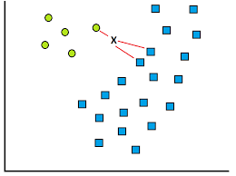

# LIN's Machine Learning Note

### K-Nearest Neighbors

#### Introduction

K-Nearest Neighbors algorithm explain itself through its name: this algorithm find the K nearest "neighbors" of one input instance by measuring **a certain kind of distance** between the instance and all the instances in our entire dataset and output some value based on the qualities of its k nearest "neighbors". 

KNN could be used in classification as well as regression.  When used in regression problem, KNN outputs **the mean or median value** of the properties of the instance's k nearest neighbors. When used in classification problem, KNN outputs the **majority vot**e outcome:  

$$ y_q=\arg_{y}\max \sum_{i=1}^{k} I(y=y_{iNN})$$

where $y_{iNN}$ is the class label of the query point's $i$-th nearest neighbor among its $k$ nearest neighbors and the function$I(s)$ takes the value of 1 when statement $s$ is true, $0$ otherwise.  

Depending on how you define the "distance" between two instance, you can implement your KNN in various way. Most often, we would choose so-called "Euclidean distance" which is define as the square root of the sum of all the squared distance in every *dimension*: 

$$ D_{Euclid}=\sqrt{(d_1^{\prime}-d_1)^2+(d_2^{\prime}-d_2)^2+\cdots+(d_n^{\prime}-d_n)^2} $$

Other popular distance in $n$-dimensional space include: 

- **Manhattan Distance**: the sum of the coordinate difference in each dimension.  

  $$ D_{Manhattan}=|d_1^{\prime}-d_1|+|d_2^{\prime}-d_2|+\cdots+|d_n^{\prime}-d_n| $$

- **Mahalanobis Distance**: see [wikipedia](https://en.wikipedia.org/wiki/Mahalanobis_distance).  

- **Cosine Distance**:  

  $$ D_{similarity}=\cos \theta=\frac{\vec{A}\cdot \vec{B}}{||\vec{A}||\cdot||\vec{B}||} $$

#### Problems within the Algorithm

1. Huge Expanse for Real-time Calculation
   Since we have to real-timely calculate the distance between one input instance and every instance in the entire dataset. The space and time the calculation takes would increase tremendously as we increase the dimension of our attribute vector for a instance or expand our dataset.  
   
   One way to tackle this is to store the information of all the "points" in our $n$-dimension space using a structure called **K-dimension Tree** which is a kind of **Binary Search Tree**. 

   See [here](https://blog.csdn.net/wi162yyxq/article/details/71514423) and [here](https://blog.csdn.net/vinceee__/article/details/83044037) more about KD tree. 
   
2. The Number Takes Over Instead of Distance  

   Suppose we have a dataset like this and we now have an input instance(query point) marked as "x" and we take its 3 nearest neighbors.  

    

   Well, you can easily tell that the instance is more likely to be an circle than a square. But the KNN algorithm thinks otherwise because it had taken the instance's 3 nearest neighbors and found 2 of them are square! So the algorithm wthenould think x as an square even though the instance is much closer to the only circle than to the two squares. 

   One way to avoid this is to use **Weighted-kNN**. 

   > In weighted kNN, the nearest k points are given a weight using a function called as **the kernel function**. The intuition behind weighted  kNN, is to give more weight to the points which are nearby and less weight to the points which are farther away. Any function can be used as a kernel function for the weighted knn classifier whose value decreases as the distance increases. 

   So basically when used in classification, our equation becomes: 
   
   $$y_q=\arg_{y}\max \sum_{i=1}^{k} w(\vec{x_q},\vec{x_{iNN}})\cdot I(y=y_{iNN})$$  
   
   where $w(\vec{a},\vec{b})$ is our weight function or **kernel function** which falls when the distance between $\vec{a}$ and $\vec{b}$ increases.  
   
   One kernel function widely used is called Gaussian kernel function which is defined as: 
   
   $$ K_{Gauss}(\vec{a},\vec{b})=e^{-\frac{||\vec{a}-\vec{b}||^2}{2\sigma^2}} $$
   
   or simply: 
   
   $$ K_{Gauss}(\vec{a},\vec{b})=e^{-\frac{||\vec{a}-\vec{b}||^2}{C}},\,C >0$$  
   
   As you can tell, the smaller $\sigma$ or $C$ is, the more rapid Gaussian function falls as $||\vec{a}-\vec{b}||$ increases. In other words, the function would be more "steep" if $\sigma$ is small, more "flat" if $\sigma$ is large.  
   
   In fact, if $\vec{a}=(0,0)$ and $\vec{b}=(x,y)$, this is what the function would look like when $\sigma=1$.
   
   
   
   when $\sigma=5$:
   
   
   
   