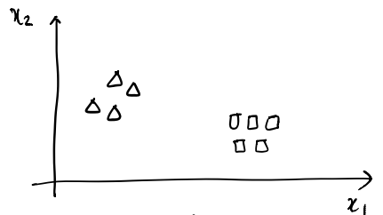
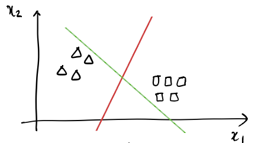
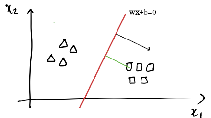
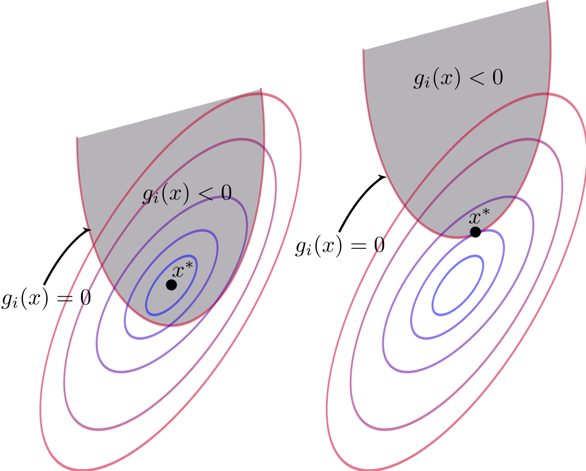
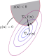
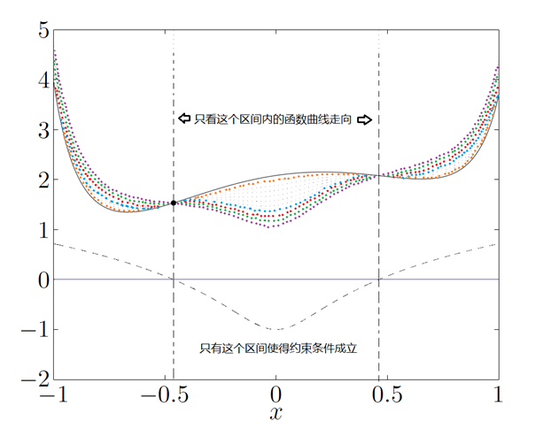
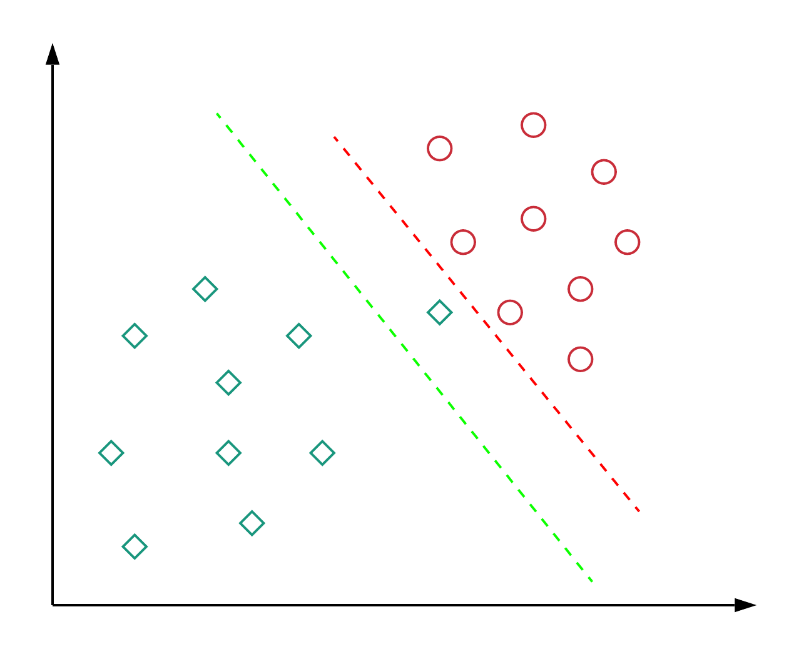

# LIN's Machine Learning Note

## Support Vector Machine

#### 1. Optimal Margin Classifier - Basic Problem

Before we start discussing optimal margin classifier, let us first look back at logistic regression. 

Say each instance in your dataset has only two attributes and your dataset looks like this:  

where $x_1,x_2$ axises each indicates one attribute of an instance and here a square stands for one positive instance while a triangle is one negative instance.  

And what LR is doing is simply trying to find a line (your $\vec{w}\cdot\vec{x}+b=0$) that can separate positive and negative examples. 

So logistic regression algorithm may come up with a decision boundary like the *green* line below which indeed perfectly separates the two classes: 

But the red line, which also separates the two classes but has a larger distance to all the points than the green line, seems to have done a better job while the green decision boundary is so close to some of the points that with a little rotation, it could just mis-classify these points.  

Or, looking back to logistic regression, when a point is very close to the decision boundary, $z$ is very close to $0$, which means $g(z)$ is very close to 0.5 and since $g(z)$ is the probability of $y=1$, this means that the algorithm is not so sure about $y=1$ or $y=0$. In contrast, when a point is quite far away from the decision boundary, $g(z)$ is very close to 1 or 0, indicating that the algorithm is quite sure about $y$ being 1 or 0. So we certainly want the distance between the decision boundary and all the points as larger as possible. Now note that this equals to **making the distance between the hyper plane and those example points that are closest to the hyper plane as larger as possible** because, apparently, if the closest are as far away as possible from the hyper plane, the rest are also as far away as possible from the plane.  

So, how can we get such a decision boundary(or hyper plane)?  

Well, since we are going to make the *distance(or "margin")* from the decision hyper plane to those example point that are nearest to the hyper plane larger,  we have to measure the *distance*. 

To get the distance, let us first expand our two dimensional problem to three dimension in which case $\vec{w}\cdot\vec{x}+b=0$ would be a plane.

And we know that a unit normal vector to a plane $F(\vec{x})=0$ would be: 

$$\hat{n}=\frac{\nabla_{\vec{x}} F(\vec{x})}{||\nabla_{\vec{x}} F(\vec{x})||}=\frac{(F_{x_1},F_{x_2},F_{x_3})}{\sqrt{F_{x_1}^2+F_{x_2}^2+F_{x_3}^2}}$$ 

Now $F(\vec{x})=\vec{w}\cdot\vec{x}+b$, so $\hat{n}=\frac{\vec{w}^T}{||\vec{w}||}$

And for any point $\vec{p}$ that is outside the plane, take any point $\vec{q}$ in the plane which satisfies $F(\vec{q})=0$, the distance between the plane and point $\vec{p}$ would be:  

$$d=|\hat{n}\cdot (\vec{p}-\vec{q})|=\frac{1}{||\vec{w}||}|\vec{w}^T\cdot (\vec{p}-\vec{q})|=\frac{1}{||\vec{w}||}|\vec{w}^T\cdot \vec{p}-\vec{w}^T\cdot\vec{q}|=\frac{1}{||\vec{w}||}|\vec{w}^T\cdot \vec{p}+b|=\frac{1}{||\vec{w}||}|\vec{w}\cdot\vec{p}+b|$$

*(Note that in the equation above, the first 4 dot($\cdot$) indicate the scalar product of two vectors and the last one indicates matrix multiplication.)*

So, for a example $\vec{x}$ in the dataset, the distance to the hyper plane is just $\frac{1}{||\vec{w}||}|\vec{w}\cdot\vec{x}+b|$.

Remember that our goal is to **maximize** the distance between the hyper plane and those example points that are **nearest** to the hyper plane. So, in other words, what we want to maximize is the shortest *point-plane distance*, and let us call this distance $\gamma$: 

$$\gamma=\frac{1}{||\vec{w}||}|\vec{w}\cdot\vec{x}_{nearest}+b|$$   

But to make $\gamma$ really be the shortest *point-plane distance*, we have to do more work. 

The first question is: how can we express **the nearest example point** in mathematical language?  

Well, that is easy, if the *point-plane distance* of any example point in dataset is larger or equals to that of a certain example point, then this example is nearest to the hyper plane and vice versa. In mathematical language, a example point is nearest to the hyper plane if and only if:  

$$\forall\vec{x}\in D,\ \frac{1}{||\vec{w}||}|\vec{w}\cdot\vec{x}+b|\ge \frac{1}{||\vec{w}||}|\vec{w}\cdot\vec{x}_{nearest}+b|$$

That is: 

$$\frac{1}{||\vec{w}||}|\vec{w}\cdot\vec{x_i}+b|\ge\gamma,\quad i=1,2,\cdots,m$$

With this constraint, our $\gamma$ is now really the shortest *point-plane distance*.

Now that we want to maximize $\gamma$, this becomes a optimal problem: choose $\vec{w},b$  to maximize $\gamma$ which satisfies the constraint above. So this is: 

$$\begin{align}\underset{\vec{w},b}{\operatorname{argmax}}\ &\gamma\\s.t.\ &\frac{1}{||\vec{w}||}|\vec{w}\cdot\vec{x_i}+b|\ge\gamma,\quad i=1,2,\cdots,m\end{align}$$

It's not that easy to solve this optimal problem, we have to simplify it a little bit. 

First, we can define $\hat{\gamma}=||\vec{w}||\gamma=|\vec{w}\cdot\vec{x}_{nearest}+b|$, then the optimal problem becomes: 

$$\begin{align}\underset{\vec{w},b}{\operatorname{argmax}}\ &\frac{\hat\gamma}{||\vec{w}||}\\s.t.\ &|\vec{w}\cdot\vec{x_i}+b|\ge\hat{\gamma},\quad i=1,2,\cdots,m\end{align}$$

What is quite special about this term is that this term can be scaled to any value by scaling $\vec{w}$ and $b$ together without changing $\gamma$ or the constraint. So why not make it equal to 1?  

So now we have: 

$$\begin{align}\underset{\vec{w},b}{\operatorname{argmax}}\ &\frac{1}{||\vec{w}||}\\s.t.\ &|\vec{w}\cdot\vec{x_i}+b|\ge1,\quad i=1,2,\cdots,m\end{align}$$

This is equivalent to the quadratic optimization problem below:  

$$\begin{align}\underset{\vec{w},b}{\operatorname{argmin}}\ &\frac12||\vec{w}||^2\\s.t.\ &|\vec{w}\cdot\vec{x_i}+b|\ge1,\quad i=1,2,\cdots,m\end{align}\tag{0}$$

*(the $\frac12$ term is just for simplifying later mathematical derivation.)*

The only thing that seems complicated is the absolute function $|\cdot|$, to make it disappear, we define our negative label to be $-1$ and positive label to be $1$, then: 

$$|\vec{w}\cdot\vec{x_i}+b|=y_i(\vec{w}\cdot\vec{x_i}+b)$$

*(I have a problem understanding this. The equation above is true only when $y_i$ and the sign of $\vec{w}\cdot\vec{x_i}+b$ is related, that is, if $\vec{w}\cdot\vec{x_i}+b$ is negative, then $y_i$ is $-1$ and when $\vec{w}\cdot\vec{x_i}+b$ is positive, $y_i$ is $1$. But this happens only when  $\vec{w}\cdot\vec{x_i}+b=0$ has perfectly separates the positive and negative examples!! )*

$$\begin{align}\underset{\vec{w},b}{\operatorname{argmin}}\ &\frac12||\vec{w}||^2\\s.t.\ &y_i(\vec{w}\cdot\vec{x_i}+b)\ge1,\quad i=1,2,\cdots,m\end{align}\tag{1}$$

#### 2. Lagrange Multiplier Method & KKT Conditions

##### 1. Equality Constrained Optimization

Let us consider the following constrained optimization problem:  

$$\begin{align}minimize\ &f(\vec{x})\\s.t.\ &h(\vec{x})=0\end{align}$$

For the convenience of illustration, let us assume that $\vec{x}$ is just a two dimensional vector which means that $z=f(\vec{x})$ is a three dimensional surface. Assume the two-dimensional contour plot of $z=f(\vec{x})$ is like this (Down below $f(\vec{x})$ is actually a **convex** function, which any local minimum is just the global minimum): 

And the black line in the graph is $h(\vec{x})=0$. There are two sets of points in *the intersecting part of $z=f(\vec{x})=C$ and $h(\vec{x})=0$ in the contour plot*(called the feasible ): tangential points and intersection points. At a tangential point, as you move along the black line from the point, no matter which direction you choose, the value of $f(\vec{x})$ **always increases** while at a intersection point, you either have one direction in which $f(\vec{x})$ goes up and another in which $f(\vec{x})$ goes down or have only one direction in which $f(\vec{x})$ goes down. We can infer from above that the minimum point must be a tangential point in the line $h(\vec{x})=0$ where the gradient of $f(\vec{x})$ and the gradient of $h(\vec{x})$ are either parallel or anti-parallel. 

So in mathematics, a local minimum point $\vec{x}^*$ for $f(\vec{x})$ in the constraint of $h(\vec{x})=0$ must satisfies: 

$$(1).\ h(\vec{x}^*)=0$$

$$(2).\ [\nabla_{\vec{x}} f(\vec{x})]|_{\vec{x}=\vec{x}^*}=\beta\cdot [\nabla_{\vec{x}} h(\vec{x})]|_{\vec{x}=\vec{x}^*}$$

This indicates that if we can solve $\vec{x}$ for: 

$$(1).\ h(\vec{x})=0$$

$(2).\ \nabla_{\vec{x}} f(\vec{x})+\alpha\cdot \nabla_{\vec{x}} h(\vec{x})=0$

Where $\alpha=-\beta$. Then the $\vec{x}$ is very likely to be the minimum of $f(\vec{x})$ under the constraint of $h(\vec{x})=0$. 

##### 2. Inequality Constrained Optimization

What if the constraint is an inequality? Consider the following optimization problem: 

$$\begin{align}minimize\ &f(\vec{x})\\s.t.\ &g(\vec{x})\le 0\end{align}$$

Generally, we may have two different situations in terms of whether the minimum point is inside the feasible region or not(again we assume $f(\vec{x})$ is a convex function):  

In the first case, the global minimum is within the feasible region which means the inequality constraint does not constrain anything in terms of the minimum found. So the original problem is equivalent to: 

$$minimize\ f(\vec{x})$$

In this case, the minimum point $\vec{x}^*$ absolutely satisfies: 

$$\begin{align}(1).\ &[\nabla_{\vec{x}} f(\vec{x})]|_{\vec{x}=\vec{x}^*}=0 \\(2).\ &g(\vec{x}^*)\le 0\end{align}\tag2$$

In the second case, the global minimum is outside the feasible region. Since the farther away a point is from the global minimum point, the larger $f(\vec{x})$ is, we can infer that the minimum point is absolutely in the curve of $g(\vec{z})=0$. So we have to find the minimum point along the curve $g(\vec{x})=0$. But this is equivalent to a single equality constraint $g(\vec{x})=0$. Hence, the original problem now equals to: 

$$\begin{align}minimize\ &f(\vec{x})\\s.t.\ &g(\vec{x})= 0\end{align}$$

in which case the minimum point $\vec{x}^*$ satisfies: 

$$\begin{equation}(1).\ g(\vec{x}^*)=0\\(2).\ [\nabla_{\vec{x}} f(\vec{x})]|_{\vec{x}=\vec{x}^*}+\alpha\cdot [\nabla_{\vec{x}} g(\vec{x})]|_{\vec{x}=\vec{x}^*}=0\end{equation}$$

But it is not over, another fact we should be aware of is that the gradient of $g(\vec{x})$ always points towards the direction in which $g(\vec{x})$ **increases** most rapidly. This means that the gradient of $g(\vec{x})$ at points along the boundary where $g(\vec{x})=0$ will points towards the side where $g(\vec{x})>0$ --- the side that is **not the feasible region**. In the meantime, the gradient of $f(\vec{x})$ at $\vec{x}^*$ as well points towards the direction in which $f(\vec{x})$ increase, so it will point against the global minimum. Since the global minimum is outside the feasible region, this means the gradient of $f(\vec{x})$  points at $\vec{x}^*$ **towards the feasible region**. This indicates that the gradient of $g(\vec{x})$ and the gradient of $f(\vec{x})$ at $\vec{x}^*$ is in opposite direction. That is, $\alpha$ must be greater than 0. So the condition list above is now: 

$$\begin{align}(1).\ &g(\vec{x}^*)=0\\(2).\ &\alpha>0\\(3).\ &[\nabla_{\vec{x}} f(\vec{x})]|_{\vec{x}=\vec{x}^*}+\alpha\cdot [\nabla_{\vec{x}} g(\vec{x})]|_{\vec{x}=\vec{x}^*}=0\end{align}\tag3$$

Combining $(2)$ and $(3)$ together, we can infer that the minimum point $\vec{x}^*$ must satisfies: 

$$\begin{align}(1).\ &g(\vec{x}^*)\le 0\\(2).\ &\alpha\cdot g(\vec{x}^*)=0\\(3).\ &\alpha\ge 0\\(4).\ &[\nabla_{\vec{x}} f(\vec{x})]|_{\vec{x}=\vec{x}^*}+\alpha\cdot [\nabla_{\vec{x}} g(\vec{x})]|_{\vec{x}=\vec{x}^*}=0\end{align}\tag4$$

This is the KKT conditions(without equality constraints and for one inequality constrained minimization problem).  

More generally, for a $m$ inequality constrained minimization problem below: 

$$\begin{align}minimize\ &f(\vec{x})\\s.t.\ &g_i(\vec{x})\le 0\quad i=1,2,\cdots,m\end{align}$$

Its minimum point $\vec{x}^*$ satisfies: 

$$\begin{align}(1).\ &g_i(\vec{x}^*)\le 0\quad i=1,2,\cdots,m\\(2).\ &\alpha_i\cdot g_i(\vec{x}^*)=0\quad i=1,2,\cdots,m\\(3).\ &\alpha_i\ge 0\quad i=1,2,\cdots,m\\(4).\ &[\nabla_{\vec{x}} f(\vec{x})]|_{\vec{x}=\vec{x}^*}+\sum_{i=1}^{m}\alpha_i\cdot[\nabla_{\vec{x}} g_i(\vec{x})]|_{\vec{x}=\vec{x}^*}=0\end{align}\tag5$$

Usually we would define a function(called Lagrangian function):  

$$\mathcal{L}(\vec{x})=f(\vec{x})+\sum_{i=1}^{m}\alpha_i g(\vec{x})$$

So the last condition of $(5)$ would be simplified as: 

$$[\nabla_{\vec{x}}\mathcal{L}(\vec{x})]|_{\vec{x}=\vec{x}^*}=0$$

So, given a one inequality constrained minimization problem: 

$$\begin{align}minimize\ &f(\vec{x})\\s.t.\ &g(\vec{x})\le 0\end{align}$$

How can we actually find its solution? 

First, from $\alpha_i\ge0$ and $g_i(\vec{x})\le0$, we can infer that $\sum_{i=1}^{m}\alpha_i\cdot g_i(\vec{x})\le0$, thus:

$$\mathcal{L}(\vec{x})=f(\vec{x})+\sum_{i=1}^{m}\alpha_i g(\vec{x})\le f(\vec{x})$$

For example, assuming we have a simple one dimension $f(x)$ shapes like the black line below and we have only one inequality constraint $g(x)\le0$. $g(x)$ is plotted in dashed line, and colored dotted line shows $\mathcal{L}_{\alpha}(x)$ with respect to different $\alpha$, you can see that all the curve of $\mathcal{L}_{\alpha}(x)$ is below the curve  of $f(\vec{x})$:  

In the feasible region, as you can see, there is one particular $\alpha^*$ that makes $\mathcal{L}_{\alpha^*}(\vec{x})$ the largest i.e. the closest to the primal function $f(\vec{x})$ among all the $\mathcal{L}(\vec{x})$ with different $\alpha$. If $\mathcal{L}_{\alpha^*}(\vec{x})$ is close enough to $f(\vec{x})$ i.e. large enough, the minimum point of $\mathcal{L}_{\alpha^*}(\vec{x})$ in the feasible region will be very very close to that of $f(\vec{x})$. This gives us a way to find the minimum point of $f(\vec{x})$:

First, find $\alpha_1^*,\alpha_2^*,\cdots,\alpha_m^*$ that maximize $L(\vec{x})$, as a very good approximation of $f(\vec{x})$ within the feasible region: 

$$\mathcal{L_{\vec{\alpha}^*}(\vec{x})}=\underset{\alpha_1,\cdots,\alpha_m\ge0}{\operatorname{max}}\mathcal{L}_{\vec{\alpha}}(\vec{x})$$

And minimize this $\mathcal{L_{\vec{\alpha}^*}(\vec{x})}$:

$$\underset{\vec{x}}{\operatorname{min}}\mathcal{L_{\vec{\alpha}^*}(\vec{x})}=\underset{\vec{x}}{\operatorname{min}}\underset{\alpha_1,\cdots,\alpha_m\ge0}{\operatorname{max}}\mathcal{L}_{\vec{\alpha}}(\vec{x})\tag6$$

But there is another perspective: If the minimum of $f(\vec{x})$ is larger than or equal to all the minimum of $\mathcal{L}_{\alpha}(\vec{x})$ and the larger the minimum of $\mathcal{L}_{\alpha}(\vec{x})$ is, the closer it is to $f(\vec{x})$(or the larger the value of $\mathcal{L}_{\alpha}(\vec{x})$ at any given point within the feasible region). Then we can first find the minimum of all $\mathcal{L}_{\alpha}(\vec{x})$ with different $\vec{\alpha}$, and look at one particular $\mathcal{L}_{\alpha^*}(\vec{x})$ which has the max minimum among all the $\mathcal{L}_{\alpha}(\vec{x})$, which according to our assumption is very close to $f(\vec{x})$, then find the corresponding minimum point $\vec{x}^*$ for $\mathcal{L}_{\alpha^*}(\vec{x})$, and this $\vec{x}^*$, which is a function of $\vec{\alpha}$ , according to our assumption, is very close to the minimum point of $f(\vec{x})$. So what we want is actually find $\vec{\alpha}^*$ that

$$\underset{\alpha_1,\cdots,\alpha_m\ge0}{\operatorname{max}}\underset{\vec{x}}{\operatorname{min}}\mathcal{L}_{\vec{\alpha}}(\vec{x})\tag7$$

which is quite similar to $(6)$, but it turns out that usually:

$$\underset{\alpha_1,\cdots,\alpha_m\ge0}{\operatorname{max}}\underset{\vec{x}}{\operatorname{min}}\mathcal{L}_{\vec{\alpha}}(\vec{x})\ge\underset{\vec{x}}{\operatorname{min}}\underset{\alpha_1,\cdots,\alpha_m\ge0}{\operatorname{max}}\mathcal{L}_{\vec{\alpha}}(\vec{x})$$

Only under certain circumstance do we have: 

$$\underset{\alpha_1,\cdots,\alpha_m\ge0}{\operatorname{max}}\underset{\vec{x}}{\operatorname{min}}\mathcal{L}_{\vec{\alpha}}(\vec{x})=\underset{\vec{x}}{\operatorname{min}}\underset{\alpha_1,\cdots,\alpha_m\ge0}{\operatorname{max}}\mathcal{L}_{\vec{\alpha}}(\vec{x})$$

Which we would assume true in SVM for the reason that we need this to simplify problem(problem $(7)$ has been proved to be a convex optimization problem which is relatively easy to solve). 

We can finally give the process of how we can actually find the minimum of $f(\vec{x})$: 

1. Find the minimum $\mathcal{L}_{\alpha}(\vec{x}^*)$ of $\mathcal{L}_{\alpha}(\vec{x})$ with respect to $\vec{x}$  and the corresponding minimum point $\vec{x}^*(\vec{\alpha})$ as two functions of $\vec{\alpha}$.
2. Choose $\vec{\alpha}^*$ that maximize $\mathcal{L}_{\alpha}(\vec{x}^*)$ and get the corresponding minimum point $\vec{x}^*(\vec{\alpha}^*)$ which is our minimum point $\vec{x}^{+}$ for $f(\vec{x})$. 
3. **Note that when processing steps above, KKT conditions $(5)$ are and should be always satisfied.** 

##### 3. Using Lagrange Method

Going back to our optimization problem $(1)$ for Optimal Margin Classifier and change its constraint a little bit: 

$$\begin{align}\underset{\vec{w},b}{\operatorname{argmin}}\ &\frac12||\vec{w}||^2\\s.t.\ &-(y_i(\vec{w}\cdot\vec{x_i}+b)-1)\le 0,\quad i=1,2,\cdots,m\end{align}\tag{8}$$

Now we have $f(\vec{w},b)=\frac12||\vec{w}||^2$, $g_i(\vec{w},b)=-(y_i(\vec{w}\cdot\vec{x_i}+b)-1)$

 So the Lagrangian function is: 

$$\begin{align}\mathcal{L}(\vec{w},b)=&\frac12||\vec{w}||^2-\sum_{i=1}^{m}\alpha_i(y_i(\vec{w}\cdot\vec{x_i}+b)-1)\\=&\frac12\vec{w}\cdot\vec{w}^T-\sum_{i=1}^{m}\alpha_i(y_i(\vec{w}\cdot\vec{x_i}+b)-1)\end{align}\tag9$$

Then make the gradient zero: 

$$\nabla_{\vec{w}} L(\vec{w},b)=0$$

$$\frac{\partial}{\partial b} L(\vec{w},b)=0$$

We would get: 

$$\vec{w}^*=\sum_{i=1}^{m}\alpha_i y_i \vec{x}_i^T\tag{10}$$

$$\sum_{i=1}^{m}\alpha_i y_i=0\tag{11}$$

Using the two equations above, we can conclude that the minimum of $\mathcal{L}(\vec{w})$ is:

$$\begin{align}min\ \mathcal{L}(\vec{w})=\mathcal{L}(\vec{w}^*)=&\sum_{i=1}^{m}\alpha_i-\frac12\sum_{i=1}^{m}\sum_{j=1,j\ne i}^{m}y_iy_j\alpha_i\alpha_j(\vec{x}_i^T\cdot\vec{x}_j)-b\sum_{i=1}^{m}\alpha_i y_i\\=&\sum_{i=1}^{m}\alpha_i-\frac12\sum_{i=1}^{m}\sum_{j=1,j\ne i}^{m}y_iy_j\alpha_i\alpha_j(\vec{x}_i^T\cdot\vec{x}_j)\\=&F(\vec{\alpha})\end{align}$$

So now we have to maximize this $F(\vec{\alpha})$ with respect to $\vec{\alpha}$, also remember that we have some constraints for $\vec{\alpha}$ in $(5)$ and $(11)$:

$$\begin{align}maximize\ &F(\vec{\alpha})\\s.t.\ &\sum_{i=1}^{m}\alpha_i y_i=0\\&\alpha_i\ge0\end{align}$$

Using SMO algorithm, we can solve $\vec{\alpha}^*$ for this optimization problem. Thus we can get $\vec{w}^+=\vec{w}^*(\vec{\alpha}^*)$ from $(10)$.

For any $\alpha_i^*>0$ in $\vec{\alpha}^*$, from the second condition in $(5)$, we can infer that $g_i(\vec{w}^+,b^+)=0$, thus we can solve $b^+$.

#### 3. Predict 

Now that we have solve $\vec{w}^+$ and $b^+$, for the optimal margin classifier optimization problem $(1)$. Now we want to predict a new example $\vec{x}^{\prime}$. 

So the optimal decision boundary or the optimal hyper plane we get is:

$$\vec{w}^+\cdot\vec{x}+b^+=0$$

Note that $\vec{w}^+=\vec{w}^*(\vec{\alpha}^*)$ and expand $\vec{w}^*$ using $(10)$:

$$\sum_{i=1}^{m}\alpha^*_i y_i (\vec{x}_i^T\cdot\vec{x})+b^+=0$$

So we need to do is just to calculate:

$$z=\sum_{i=1}^{m}\alpha^*_i y_i (\vec{x}_i^T\cdot\vec{x}^{\prime})+b^+$$

and predict 1 if $z\ge0$, -1 if $z<0$.

#### 4. Improvements

##### 1. Soft Margin for Overcoming Over-fitting

Consider a dataset like this 

##### 2. Kernel Trick for Non-linear Classification and Avoiding Inner Products Calculation

#### 5. SMO Algorithm

#### 6. More At

[Zhihu Column - Support Vector Machine](https://zhuanlan.zhihu.com/p/77750026)

[Quora - What is an intuitive explanation of the KKT conditions?](https://www.quora.com/What-is-an-intuitive-explanation-of-the-KKT-conditions)

[Pluskid's Blog - SVM Series](http://blog.pluskid.org/?page_id=683)