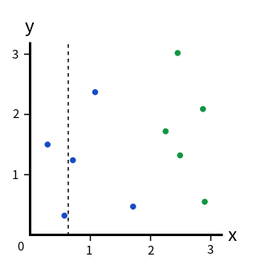

# LIN's Machine Learning Note

## Decision Tree

A Decision Tree is a tree that splits the whole example space into several parts so that most examples in each part have a identical or similar quality. In a binary decision tree, every internal node splits example space of its parent node into two branches according to a certain condition about a certain feature and every leaves of a decision tree presents a part of the example space that contains examples of which majority have an identical or similar quality.  The condition is usually an inquiry about the value of a certain feature of examples in the parent example space. 

A normal question to ask is how to choose the condition of each internal node so that the split make sense? Since a condition contains a inquiry subject i.e. a certain feature and a threshold, we have to choose the **best** of both. So the basic idea is that **for every feature (that are different from the inquiry feature of parent node), you first choose the best threshold so that the partition based on that feature is best, then you choose the best feature according to the previous step.** You then do this recursively until the partitions are enough, note that if the partitions are too many, you can easily over-fit the training set, thus we usually have **a limit of the maximum depth of a decision tree** or **the minimum number of examples within a partition**. Or we will **prune the tree a little bit after the tree has been built** or less often estimate how much a partition will improve the accuracy in other dataset(such as dev or test set) before we even do the partition. 

So, let us dive deeper into the first step: choose the best threshold for every feature. In the case of the value of a feature being discrete, such as 1,2 and 3, you just need to test every discrete value as the branching value and see which one is *best**.

And in the case of the value of a feature being continuous, you can get thresholds by binary partition, that is, first sort all the different attribute values of all the examples in the parent example space in ascending order and just divide them into two branches using the median of any two neighbouring values and see which partition is *best**.

After the first step, you just need to choose the *best** feature and partition the parent example space and do all of this recursively. 

But, clearly,  we have not yet choose any **criterion** that evaluates what is the *best**. 

#### Criteria
##### 1. Gini Inpurity

Well, since one of our aim for branching is purifying the partitioned sub-sets of the parent example space, we can somehow quantify the inpurity and calculate the inpurity of each of the partitioned sub-set and since a good partition   means that you make **both** sides as pure  as possible, we have to sum up the impurities of all partitioned sub-set to get a overall inpurity. 

One way to calculate the inpurity is to randomly pick one example in a dataset and to see what the probability of mis-lassifying this example by randomly classifying it just according to the distribution of the dataset. 

For example, say we have a dataset like this and you split it using the black dashed line:

So on the right side of the splitting line, $5/6$ are green examples and $1/6$ are blue example, so the probability of picking out one blue example would be $5/6$ and the probability of classifying it as a green example, according to the distribution, would be $1/6$ while the probability of picking one green example out is $1/6$ and the probability of classifying it as a blue example is $5/6$. So on the right side, in general, the probability of mis-classifying a example we randomly picked out from the dataset by classifying it according to the distribution of dataset is:

$$\frac56\cdot\frac16+\frac16\cdot\frac56=\frac{5}{18}$$

In generally, the probability we have just discussed, which is called Gini Inpurity, can be written as:

$$G=\underset{c\in C}{\sum} p(c)(1-p(c))$$

where $C$ is the set of all the classes in a classification problem, and $p(c)$ is the probabilty of $x\in c$ if you randomly pick one example $x$ from the dataset.

##### 2. Information Entropy And Information Gain

The information entropy, is a concept from information theory, which:

> ... can be interpreted as the average level of "information", "surprise", or "uncertainty" inherent in the variable's possible outcomes.
>
> ... is the [expected value](https://en.wikipedia.org/wiki/Expected_value) of the [self-information](https://en.wikipedia.org/wiki/Self-information), a related quantity also introduced by Shannon. The self-information quantifies the level of information or surprise associated with *one* particular outcome or event of a random variable, whereas the entropy quantifies how "informative" or "surprising" the *entire random variable* is, averaged on all its possible outcomes.

Basically, you can consider the class label for each example in a dataset a random variable, take the example of binary classification we have seen:

if we consider the right side of the splitting line as our sample space and therefore there are six "events", five of them being that the example is green and one of them being that the example is blue, thus the color(class) of a example become a random variable that have two values. As we can see that if we randomly pick one example out form the sample space, the probability of this example being blue is $p(blue)=1/6$ while the probability of this example being green is $p(green)=5/6$, much greater than the former, so there is no much surprise if we pick one out and find it green since the probability is high while if we find it blue, it might be a little surprise since the probablity is so low.  

So, in intuition, a event is less surprising if it is more likely to happen. Based on this intuition, we introduce the self information (or information content, "surprisal", which is also a random variable) of one single event $x$ as:

$$I(x)=-\log p(x)$$

We also have:

$$p(I(x))=p(x)$$

And the information entropy is just the mean(or expected value) of all the self information value of all the possible events which describes the overall average *suprisal* of random variable $X$:

$$H(X)=E[I_X]=\underset{x\in A_X}{\sum} p(I(x))\cdot I(x)=\underset{x\in A_X}{\sum}p(x)\cdot-\log p(x)=-\underset{x\in A_X}{\sum}p(x)\cdot\log p(x)$$

where $X$ stands for one random variable, $x$ is one possible outcome or event in sample space and $A_X$ stands for the event space of random variable $X$.

Just like knowing in advance that today will be windy and cloudy will decrease the surprise of being caught in a rainstorm even though it has not rained for a long time, the information of another related random variable $Y$ will influence the information entropy of one random variable, this influence is described in conditional entropy:

$$\begin{align}H(X|Y)&=\underset{y\in A_Y}{\sum} p(y)H(X|Y=y)\\&=\underset{y\in A_Y}{\sum} p(y)\underset{x\in A_X}{\sum} p(x|y)\log p(x|y)\end{align}$$

where $Y$ is a *discrete* random variable and the meanings of related symbols stays the same.

And the change of information entropy of random variable $X$ (called information gain):

$$IG=H(X|Y)-H(X)$$

describes how the information of another related random variable $Y$ decreases the original entropy. 

Going back to our problem, what we going to do is to purify every partitioned sub-set. It turns out that if the information entropy of a set is low, than the set tends to be more uniform. So 

More at:
[Wikipedia - Infomation Content](https://en.wikipedia.org/wiki/Information_content)
[Wikipedia - Entropy(Information Theory)](https://en.wikipedia.org/wiki/Entropy_(information_theory))
[Wikipedia - Conditioned Entropy](https://en.wikipedia.org/wiki/Conditional_entropy)